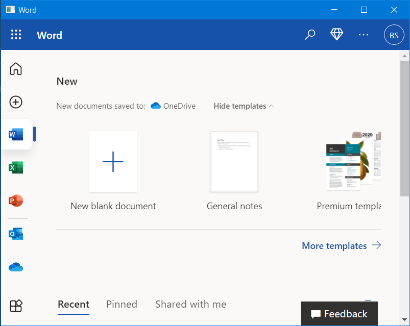
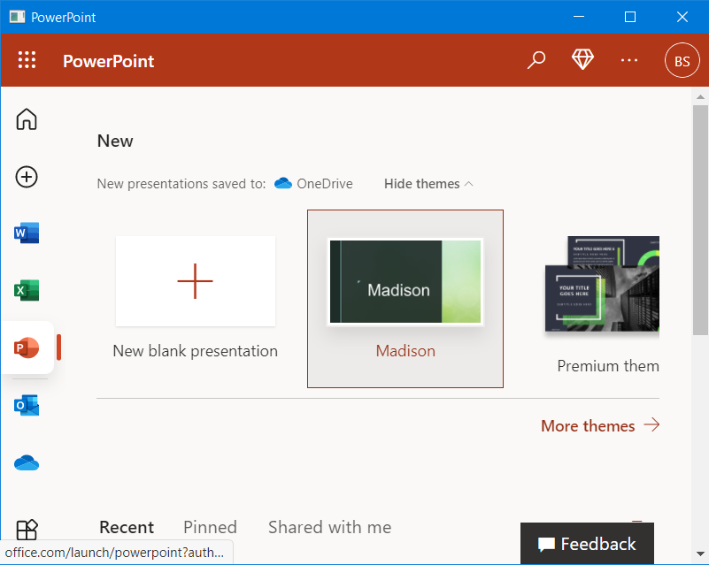
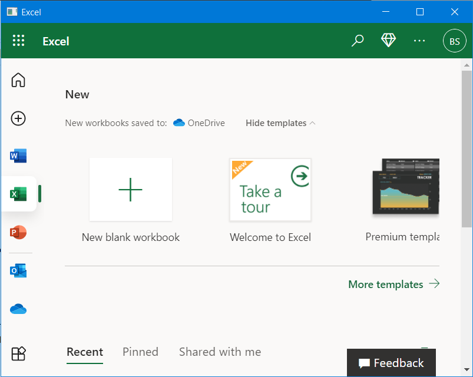

# office-wrappers

Office Wrappers is a project to package the online versions of Office to exe. The go files **should** run in Linux but untested. You have to sign in but that's free.

## Screenshots

### Word

### PowerPoint

### Excel

## Building Requirements (for Windows)

- Latest version of Go (in PATH)
- Resource Hacker (in PATH)
